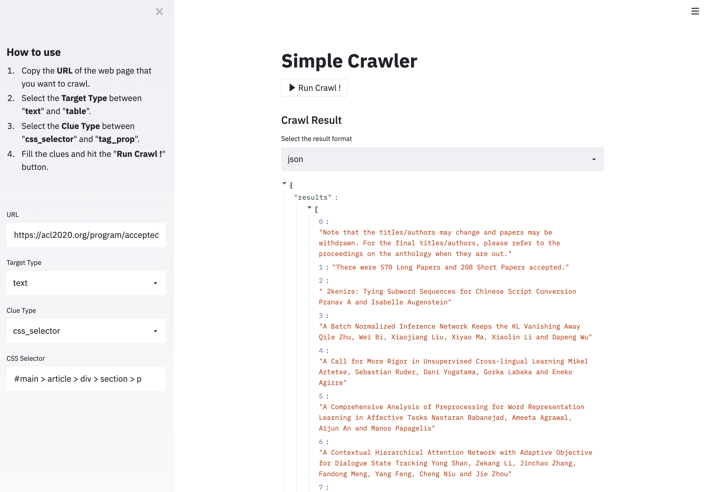
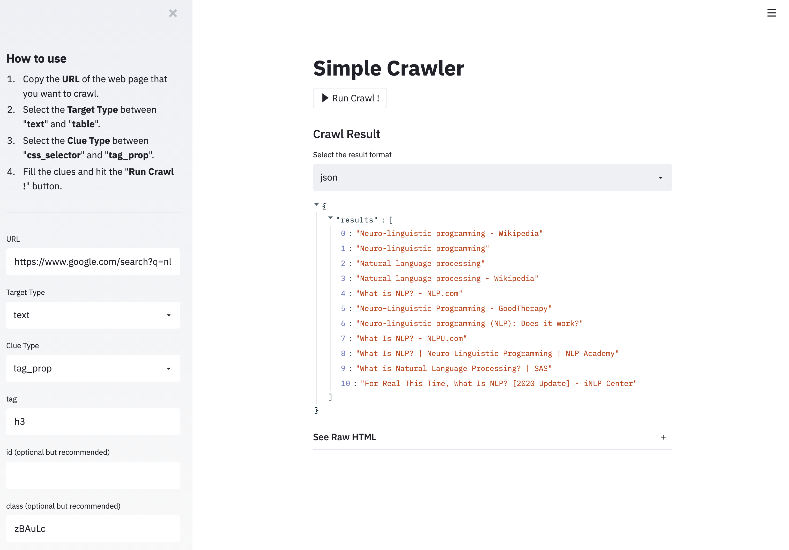
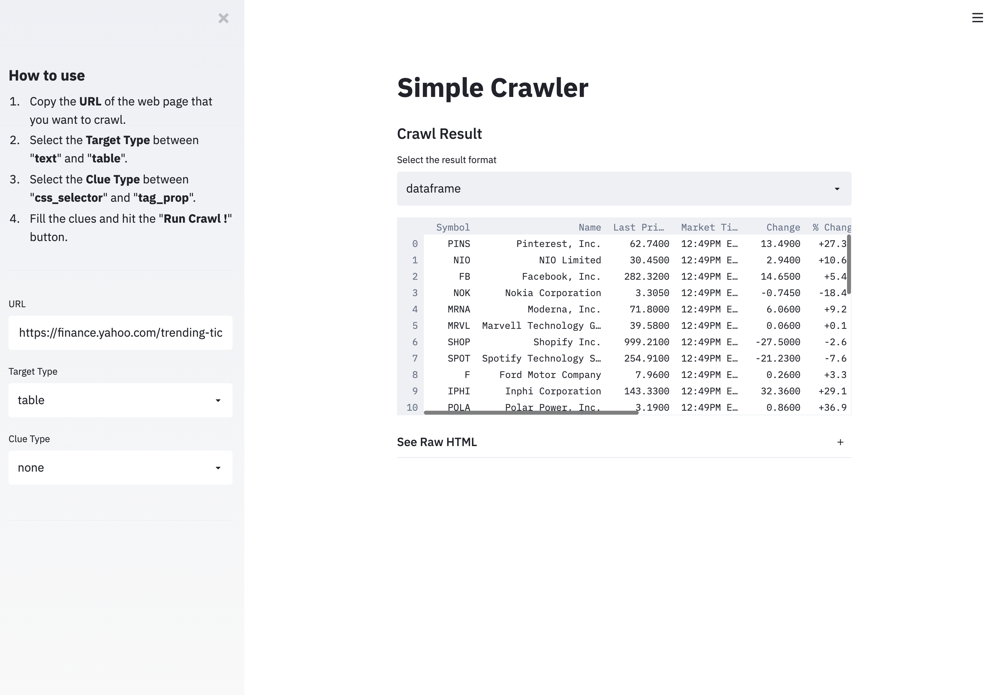
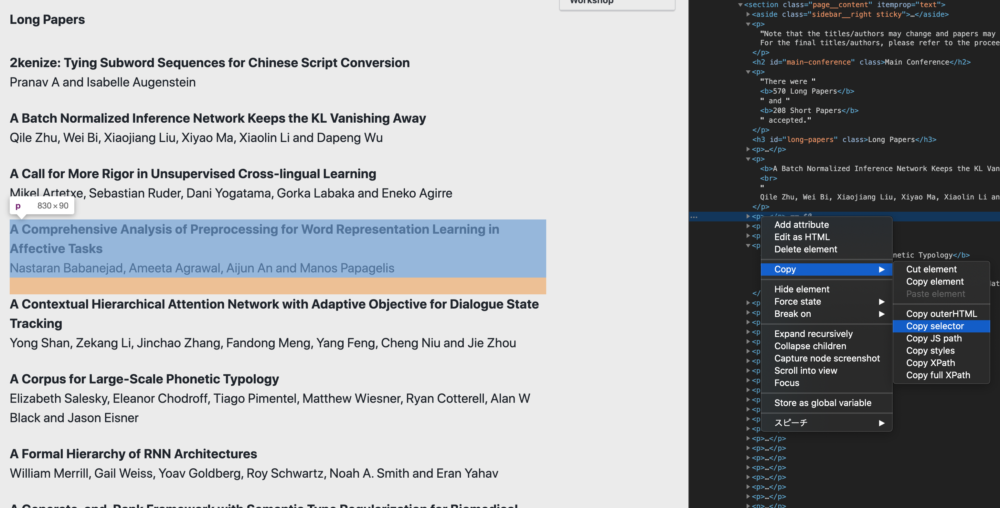

# Simple Crawler [🔗](https://share.streamlit.io/peinan/streamlit-simple-crawler/main/main.py)

A simple but useful crawler based on streamlit.

  
  
  

## Examples

### Use case 1: Crawl all the papers

- URL: https://acl2020.org/program/accepted/
- Target Type: text
- Clue Type: css_selector
- CSS Selector: `#main > article > div > section > p`

### Use case 2: Crawl all the search results

- URL: https://www.google.com/search?q=nlp
- Target Type: text
- Clue Type: tag_prop
- tag: h3
- id: None
- class: zBAuLc

### Use case 3: Crawl the table

- URL: https://finance.yahoo.com/trending-tickers
- Target Type: table
- Clue Type: none

## FAQ

### How to check the CSS Selector?

Open the URL with chrome (or other chromium-based browsers), execute the developer tools, find out the element you want to crawl, right click > copy > copy selector.

The Screenshot

### The environment are different between my browser and the app

Check the full HTML after running crawl, and find the proper attributes.

### Can crawling images?

Future works 🤗
